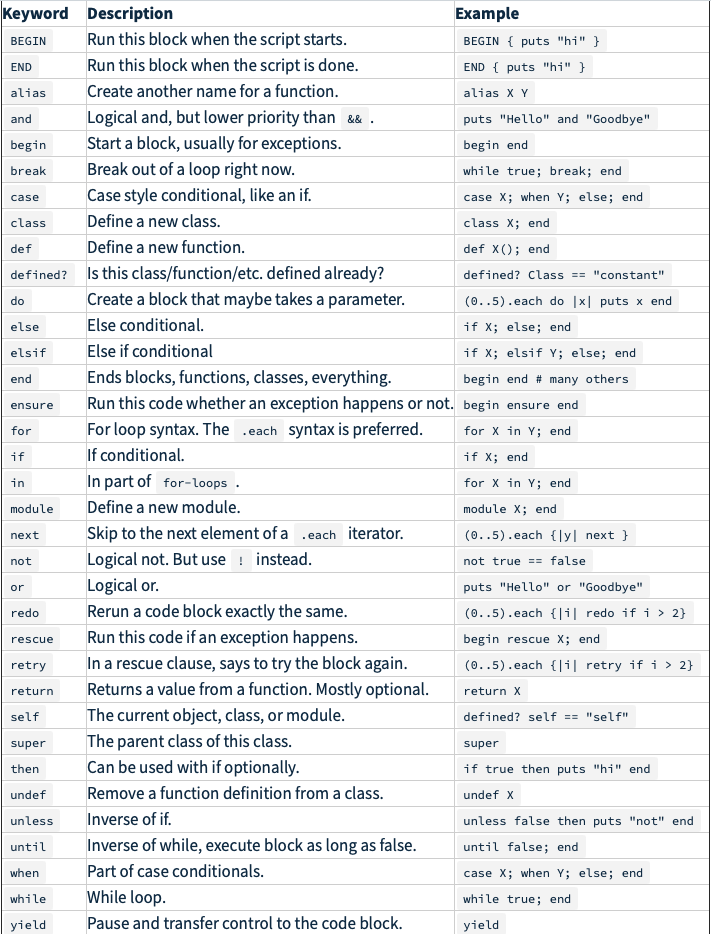
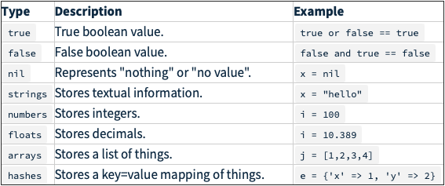
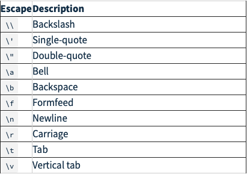
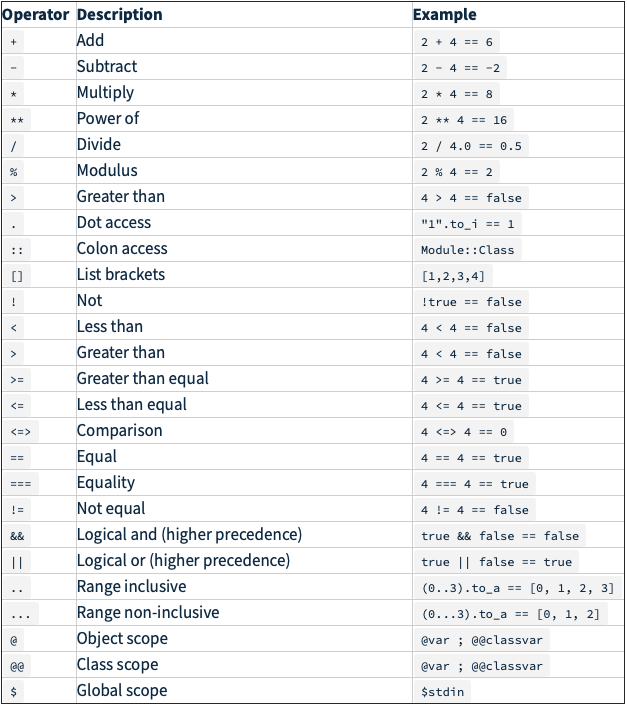

# SYMBOL REVIEW

Keywords
========

Data Types
==========

Escape Sequences
================

Operators
=========

Notes:

+ Comparison operator: x <=> y returns:
    + -1 if x < y
    + 0 if x == y
    + 1 if x > y
    + nil if x and y are not comparable
